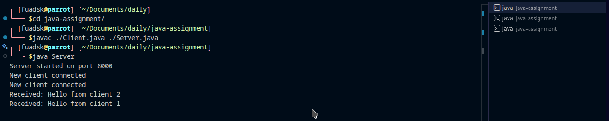
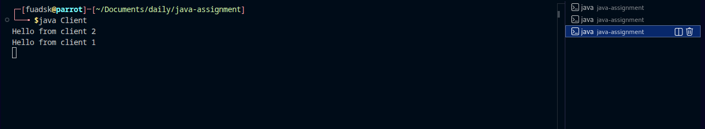

Multi-Client Chat Application (Java TCP Sockets)

## Overview

A simple multi-client chat application using Java TCP sockets. The server handles each client in its own thread to enable simultaneous, two-way communication across multiple terminals.

## Features

- TCP-based client–server architecture
- Supports multiple concurrent clients
- Two-way messaging between clients via the server
- Thread-per-connection concurrency on the server
- Console-based interface

## Technologies

- Java
- TCP Sockets (`ServerSocket`, `Socket`)
- Multithreading (`Thread`, `Runnable`)
- I/O Streams (`BufferedReader`, `PrintWriter`)

## Project Structure

```
multi-client-chat-app/
├── Server.java   # Chat server
├── Client.java   # Chat client
└── README.md     # Documentation
```

## System Architecture

### Server

- Listens on a fixed TCP port via `ServerSocket`
- Accepts client connections with `accept()`
- Spawns a thread per connected client
- Broadcasts messages from one client to all others

### Client

- Connects to the server using `Socket`
- Sends user-entered messages to the server
- Receives and displays server-broadcast messages

## Message Flow

1. Server starts and listens on a TCP port.
2. Clients connect to the server.
3. Server accepts each connection and starts a dedicated thread.
4. Clients send messages to the server.
5. Server relays messages to all other connected clients.
6. All clients display the broadcast messages.

## Clone and Setup

Clone the repository and enter the project directory:

```bash
git clone https://github.com/mroxygen2024/multi-client-chat-app.git
cd multi-client-chat-app
```

If you already have `Server.java` and `Client.java` locally in this workspace, you can skip cloning and use the compile/run steps below.

## How to Compile and Run

1. Compile sources:
   ```bash
   javac Server.java Client.java
   ```
2. Start the server:
   ```bash
   java Server
   ```
3. Start each client in a separate terminal:
   ```bash
   java Client
   ```
   Launch as many clients as needed by opening additional terminals.

## Sample Output

### Server

```
Server started on port 8000
New client connected
```

### Client

```
Hello everyone
```

Messages sent by one client appear in other clients.

## Screenshots

Here are screenshots from a `screenshots/` folder:

| View              | Image                                     |
| ----------------- | ----------------------------------------- |
| Server terminal   |  |
| Client 1 terminal |      |
| Client 2 terminal |      |

## Assignment Requirements

- Uses TCP sockets
- Separate client and server programs
- Server handles multiple clients with threads
- Two-way communication between client and server

## Conclusion

This project provides a concise example of a multi-client chat system built with Java TCP sockets, illustrating networking and concurrency fundamentals.

## License 

MIT
